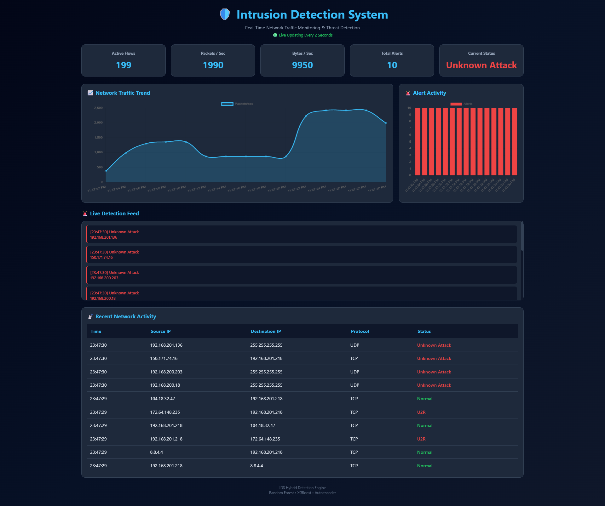

# Hybrid Intrusion Detection System (IDS)

Real-Time Network Traffic Monitoring and Threat Detection using Machine Learning and Deep Learning

---

## 1. Dashboard Preview



The dashboard provides real-time monitoring of network traffic, active flows, detected threats, traffic statistics, and alert visualization.

---

## 2. Project Overview

This project implements a Hybrid Intrusion Detection System capable of monitoring live network traffic and identifying malicious behavior using a combination of Machine Learning and Deep Learning models.

The system captures network packets, generates traffic flows, extracts statistical features, performs inference using trained models, and visualizes results through an interactive dashboard.

The architecture combines supervised classification and anomaly detection to improve detection capability for both known and previously unseen attacks.

---

## 3. Objectives

1. Monitor live network traffic.
2. Detect malicious activity in real time.
3. Classify known attack categories.
4. Identify unknown anomalies using deep learning.
5. Provide real-time visualization and alerting.
6. Demonstrate practical cybersecurity and AI integration.

---

## 4. Key Features

### 4.1 Real-Time Traffic Monitoring

* Live packet capture
* Flow generation
* Active connection tracking

### 4.2 Machine Learning Detection

* Random Forest Classification
* XGBoost Classification
* Hybrid decision mechanism

### 4.3 Deep Learning Detection

* Autoencoder-based anomaly detection
* Unknown attack identification

### 4.4 Dashboard Analytics

* Active Flows
* Packets per Second
* Bytes per Second
* Alert Activity
* Traffic Trends
* Detection Feed
* Network Activity Logs

---

## 5. System Architecture

Network Traffic

↓

Packet Capture

↓

Flow Generation

↓

Feature Extraction

↓

Random Forest

↓

XGBoost

↓

Autoencoder

↓

Hybrid Decision Engine

↓

Dashboard Visualization

---

## 6. Models Used

### 6.1 Random Forest

Purpose:
Detection of known attack patterns through ensemble learning.

### 6.2 XGBoost

Purpose:
High-performance attack classification using gradient boosting.

### 6.3 Autoencoder

Purpose:
Detection of previously unseen attacks through anomaly detection.

---

## 7. Hybrid Detection Strategy

The final prediction is generated using outputs from all three models.

### Normal Traffic

Traffic identified as benign by the detection pipeline.

### Known Attack

Traffic classified by Random Forest and XGBoost into known attack categories.

### Unknown Attack

Traffic flagged as anomalous by the Autoencoder reconstruction error threshold.

---

## 8. Project Structure

```text
IDS_Project/
│
├── backend/
├── frontend/
├── models/
├── data/
├── src/
├── assets/
├── requirements.txt
├── main.py
└── README.md
```

---

## 9. Technology Stack

### Backend

* Python
* Flask
* Scapy

### Machine Learning

* Scikit-Learn
* XGBoost

### Deep Learning

* TensorFlow
* Keras

### Frontend

* HTML
* CSS
* JavaScript
* Chart.js

---

## 10. Installation

### Step 1: Clone Repository

```bash
git clone https://github.com/chandu2006-git/Intrusion-detection-system-.git

cd Intrusion-detection-system-
```

### Step 2: Create Virtual Environment

Windows:

```bash
python -m venv venv

venv\Scripts\activate
```

Linux:

```bash
python3 -m venv venv

source venv/bin/activate
```

### Step 3: Install Dependencies

```bash
pip install -r requirements.txt
```

---

## 11. Running the Project

Start the backend:

```bash
python -m backend.app
```

or

```bash
python main.py
```

Open frontend:

```text
frontend/index.html
```

or

```text
http://localhost:5500/frontend/index.html
```

---

## 12. Dashboard Metrics

### Active Flows

Number of active network flows currently monitored.

### Packets Per Second

Traffic volume measured in packets.

### Bytes Per Second

Network throughput.

### Alert Count

Total detected suspicious activities.

### Current Status

Current network security state.

---

## 13. Important Notes

* This project performs local packet capture.
* Administrator privileges may be required.
* Designed primarily for research, education, and portfolio demonstration.
* Not intended for direct deployment on static hosting platforms.
* Best suited for local execution environments.

---

## 14. Skills Demonstrated

* Cybersecurity
* Intrusion Detection Systems
* Network Traffic Analysis
* Machine Learning
* Deep Learning
* Anomaly Detection
* Feature Engineering
* Flask API Development
* Frontend Dashboard Design
* Real-Time Data Processing

---

## 15. Interview Discussion Topics

* Intrusion Detection Systems
* Network Security Fundamentals
* Random Forest
* XGBoost
* Autoencoders
* Anomaly Detection
* Hybrid Machine Learning Systems
* Real-Time Analytics
* Feature Extraction
* Flask Architecture

---

## 16. Future Enhancements

1. Docker Support
2. Distributed Monitoring Agents
3. SIEM Integration
4. Threat Intelligence Feeds
5. Historical Traffic Analytics
6. Cloud-Based Monitoring
7. Multi-Node Detection Architecture

---

## 17. Author

Chandra Sekhar

Machine Learning | Deep Learning | Cybersecurity | Full Stack Development
